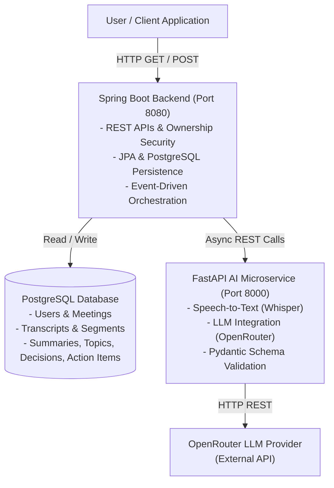
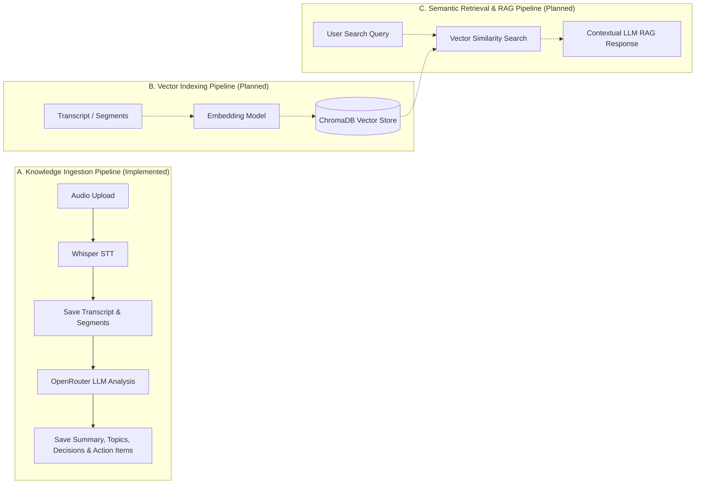
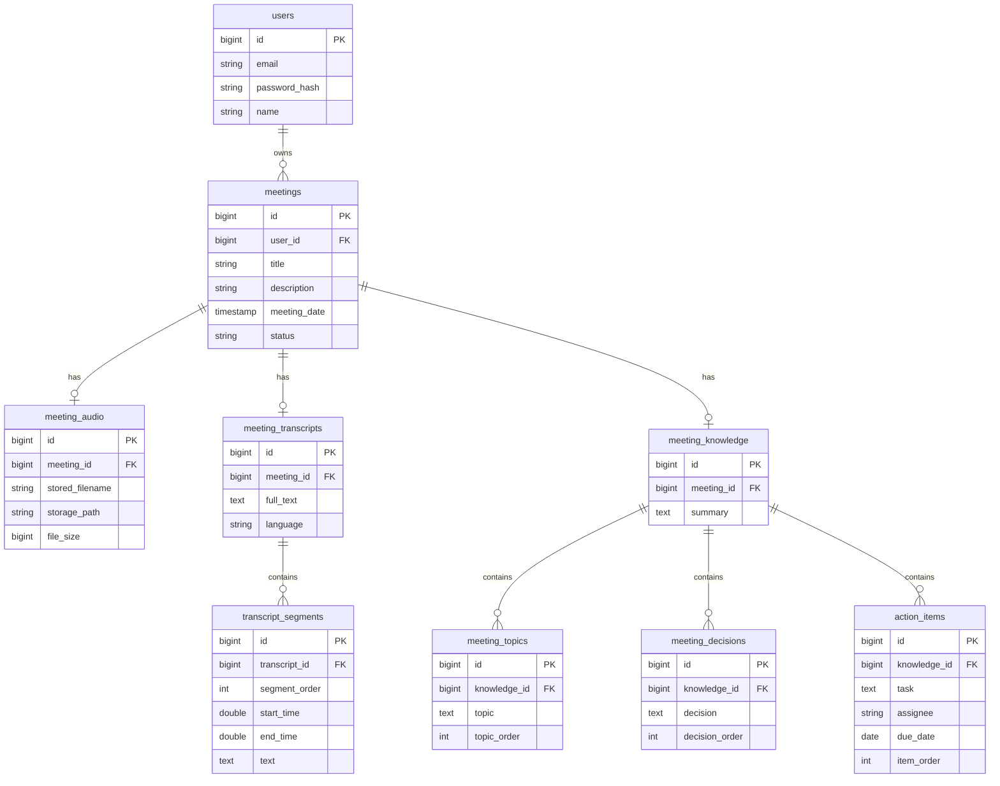

# AI-Powered Organizational Knowledge Management Platform

> **Intelligent Meeting Understanding and Semantic Knowledge Retrieval**

---

## 1. Project Overview

The **AI-Powered Organizational Knowledge Management Platform** is an enterprise-grade platform designed to automatically transform raw meeting audio recordings into structured, queryable organizational knowledge.

Modern organizations generate vast amounts of unstructured knowledge in daily syncs, planning sessions, and technical reviews. This platform automates the knowledge extraction pipeline: from audio ingestion and Speech-to-Text (STT) transcription to LLM-driven meeting understanding (extracting executive summaries, key topics, decisions, and action items with assignees and due dates) and structured relational persistence.

---

## 2. Problem Statement

Organizational knowledge generated during meetings is frequently lost or fragmented due to:
* **Manual Note-Taking Inefficiencies**: Human notes are incomplete, subjective, or inconsistent.
* **Information Silos**: Key technical decisions and action items remain buried in unindexed audio files or lengthy video recordings.
* **Lack of Accountability**: Action items discussed verbally are often forgotten without clear ownership and due dates.
* **Inability to Search Past Discussions**: Finding when a decision was made or why a choice was selected requires re-listening to hours of recorded meetings.

---

## 3. Objectives

* **Automate Knowledge Extraction**: Convert meeting audio into structured, machine-readable summaries, key topics, decisions, and action items.
* **Guarantee Multi-Tenant Security & Ownership**: Enforce resource ownership boundaries so users can only access their own meetings, transcripts, and extracted knowledge.
* **Decouple Heavy AI Workloads**: Use a dedicated microservice architecture separating core business logic (Spring Boot) from AI inference (FastAPI with OpenAI Whisper and OpenRouter LLMs).
* **Ensure Robust Fault Tolerance**: Asynchronously process heavy transcription and LLM workloads so web APIs remain responsive, while preserving transcripts even if downstream LLM analysis fails.

---

## 4. Key Features

* **Secure Authentication & Ownership**: JWT-based stateless authentication with BCrypt password hashing.
* **Meeting Lifecycle Management**: Complete meeting creation, tracking (`CREATED`, `PROCESSING`, `COMPLETED`, `FAILED`), and deletion.
* **Asynchronous Audio Processing**: Non-blocking audio file upload supporting MP3, WAV, M4A, WebM, and OGG formats up to 50 MB.
* **Speech-to-Text (STT) Integration**: Local Whisper model transcription generating full text along with timestamped audio segments.
* **LLM-Based Meeting Understanding**: Structured meeting extraction via OpenRouter LLM interface with strict Pydantic schema validation.
* **Relational Knowledge Persistence**: Full PostgreSQL relational storage for meeting transcripts, timestamped segments, executive summaries, topics, decisions, and action items.

---

## 5. System Architecture

The platform follows a decoupled, microservice-based architecture comprising a **Spring Boot Primary Backend**, a **Python FastAPI AI Microservice**, and a **PostgreSQL Relational Database**.



### Pipelines Overview



1. **Primary Knowledge Ingestion Pipeline *(Implemented)***: Audio Upload $\rightarrow$ Spring Boot Audio Storage $\rightarrow$ Event Commit $\rightarrow$ Async Processing $\rightarrow$ FastAPI Whisper Transcription $\rightarrow$ Relational Transcript & Segment Storage $\rightarrow$ OpenRouter LLM Meeting Analysis $\rightarrow$ Relational Knowledge Persistence $\rightarrow$ `COMPLETED` Status.
2. **Vector Indexing Pipeline *(Planned / Future Scope)***: Chunking text transcripts and generating dense vector embeddings for vector store indexing.
3. **User Query & Semantic Retrieval Pipeline *(Planned / Future Scope)***: RAG-driven vector search over meeting knowledge with source citations and timestamp references.

---

## 6. Functional Modules

| Module # | Module Name | Scope & Purpose | Implementation Status |
| :--- | :--- | :--- | :--- |
| **1** | **Meeting Management** | User registration, authentication, meeting creation, metadata management, and security boundaries. | **Completed** |
| **2** | **Speech-to-Text Processing** | Audio upload handling, validation, local Whisper STT model invocation, and timestamped segment parsing. | **Completed** |
| **3** | **AI Meeting Understanding** | Prompt engineering, OpenRouter LLM abstraction, structured JSON extraction, and Pydantic validation. | **Completed** |
| **4** | **Knowledge Management & Storage** | Relational database schema for storing transcripts, segments, summaries, topics, decisions, and action items. | **Completed** |
| **5** | **Semantic Search & RAG** | Vector embeddings, ChromaDB integration, hybrid similarity search, and citation-backed question answering. | **Planned (Future Scope)** |
| **6** | **User Interface & Dashboard** | Web frontend for uploading meetings, viewing transcripts, exploring extracted knowledge, and managing tasks. | **In Progress** |

---

## 7. Current Implementation Status

### Implemented Functionality
* **Stateless JWT Authentication**: User registration and login with BCrypt password hashing and custom Spring Security filters.
* **Meeting & Audio Management**: Meeting CRUD endpoints, file upload validation (type and size restrictions), and disk storage.
* **Decoupled AI Processing**: Event-driven `@Async` pipeline using Spring `@TransactionalEventListener(phase = AFTER_COMMIT)` to trigger background processing safely after transaction commits.
* **Speech-to-Text (STT)**: FastAPI service integrating OpenAI Whisper for local audio transcription.
* **Relational Transcript Persistence**: Full text and timestamped segment storage (`meeting_transcripts` and `transcript_segments`).
* **LLM Abstraction & Analysis**: `LLMService` abstraction with `OpenRouterLLMService` implementation calling OpenRouter API with `meta-llama/llama-3.3-70b-instruct:free`.
* **Strict Validation**: Input length safety checks, empty transcript fast-path, and Pydantic date/schema validation.
* **Relational Knowledge Persistence**: Complete JPA storage for `meeting_knowledge`, `meeting_topics`, `meeting_decisions`, and `action_items`.
* **Automated Testing**: 51 Spring Boot backend tests and 17 FastAPI Python tests.

### Planned Functionality (Not Yet Implemented)
* Dense vector embedding generation.
* ChromaDB vector database storage.
* Semantic vector search and RAG question answering.
* Citation generation linking search results back to exact audio timestamps.

---

## 8. Technology Stack

* **Primary Backend (Spring Boot)**
  * Java 21
  * Spring Boot 3.5.0 (Spring Web, Spring Data JPA, Spring Security, Validation)
  * JJWT (`io.jsonwebtoken:jjwt-api:0.12.6`)
  * PostgreSQL (`org.postgresql:postgresql`)
  * Maven
* **AI Microservice (FastAPI)**
  * Python 3.12
  * FastAPI 0.115.0 & Uvicorn
  * Pydantic v2 & `pydantic-settings`
  * OpenAI Whisper (`openai-whisper`)
  * HTTPX (`httpx`)
* **Frontend Application**
  * React 19
  * Vite 6
  * React Router 7
* **Testing Stack**
  * JUnit 5, Mockito, Spring Security Test, `MockRestServiceServer`
  * Pytest, Pytest AnyIO, HTTPX Mocking

---

## 9. Project Structure

```
AI-Meeting-Knowledge-Platform/
├── backend/                                   # Spring Boot Primary Backend
│   ├── src/main/java/com/aimeetingknowledge/platform/
│   │   ├── aiservice/                         # FastAPI Integration & RestClient
│   │   │   ├── dto/                           # Transcription & Analysis DTOs
│   │   │   ├── AiServiceClient.java
│   │   │   └── RestClientAiServiceClient.java
│   │   ├── auth/                              # Authentication Controllers & Services
│   │   ├── config/                            # Security & Async Configuration
│   │   ├── error/                             # Global Exception Handling
│   │   ├── meeting/                           # Meeting Domain
│   │   │   ├── audio/                         # Audio Storage, Events & Processor
│   │   │   ├── knowledge/                     # Knowledge Entities, Service & Controller
│   │   │   └── transcript/                    # Transcript Entities, Service & Controller
│   │   ├── security/                          # JWT Filters & Entry Points
│   │   └── user/                              # User Entity & Repository
│   └── src/test/java/                         # Unit & Security Integration Tests (51 tests)
├── ai-service/                                # Python FastAPI AI Microservice
│   ├── app/
│   │   ├── routers/                           # FastAPI Endpoints (/transcribe, /analyze)
│   │   ├── schemas/                           # Pydantic Output & Input Schemas
│   │   ├── services/                          # Whisper STT & OpenRouter LLM Service
│   │   ├── config.py                          # Pydantic BaseSettings Configuration
│   │   └── main.py                            # FastAPI Application Factory
│   ├── tests/                                 # Pytest Test Suite (17 tests)
│   └── requirements.txt                       # Python Dependencies
└── frontend/                                  # React + Vite Frontend Application
    ├── src/
    │   ├── api/                               # API Clients
    │   ├── auth/                              # Auth Context & Views
    │   └── pages/                             # Dashboard & Meeting Views
    └── package.json
```

---

## 10. Backend API Overview

All `/api/meetings/**` endpoints require a valid JWT token in the `Authorization: Bearer <token>` header.

| HTTP Method | Endpoint | Description | Auth Required | Expected Status |
| :--- | :--- | :--- | :--- | :--- |
| `POST` | `/api/auth/register` | Register a new user account | No | `201 Created` |
| `POST` | `/api/auth/login` | Authenticate user and receive JWT token | No | `200 OK` |
| `POST` | `/api/meetings` | Create a new meeting record | Yes | `201 Created` |
| `GET` | `/api/meetings` | List all meetings owned by authenticated user | Yes | `200 OK` |
| `GET` | `/api/meetings/{id}` | Get meeting metadata by ID | Yes | `200 OK` / `404` |
| `DELETE` | `/api/meetings/{id}` | Delete meeting and associated audio/data | Yes | `200 OK` / `404` |
| `POST` | `/api/meetings/{id}/audio` | Upload meeting audio file (starts STT + LLM pipeline) | Yes | `200 OK` / `400` / `404` |
| `GET` | `/api/meetings/{id}/audio` | Get audio metadata for an owned meeting | Yes | `200 OK` / `404` |
| `DELETE` | `/api/meetings/{id}/audio` | Delete audio file from storage and database | Yes | `200 OK` / `404` |
| `GET` | `/api/meetings/{id}/transcript` | Get full transcript and timestamped segments | Yes | `200 OK` / `404` |
| `GET` | `/api/meetings/{id}/knowledge` | Get extracted summary, topics, decisions, and action items | Yes | `200 OK` / `404` |

---

## 11. AI Service Overview

The Python FastAPI microservice runs on port `8000` and encapsulates all AI inference tasks:

* `GET /health`: Returns service health status and environment details.
* `POST /transcribe`: Accepts a multipart audio upload, writes it safely to a temporary path, executes Whisper speech-to-text, and returns the filename, full text, language, and timing segments.
* `POST /analyze`: Accepts JSON `{"text": "..."}`, validates transcript length, invokes OpenRouter LLM via `OpenRouterLLMService` using structured JSON output, validates the output with Pydantic, and returns summary, key topics, decisions, and action items.

---

## 12. Database Design

The system uses PostgreSQL for relational data persistence.



---

## 13. Configuration & Environment Variables

### Backend (`application.yml`)
Key configuration variables used by Spring Boot:
* `DB_URL`: PostgreSQL JDBC connection URL.
* `DB_USERNAME` / `DB_PASSWORD`: PostgreSQL credentials.
* `JWT_SECRET`: Secret key for JWT signing.
* `AI_SERVICE_URL`: Base URL of FastAPI service (default: `http://localhost:8000`).

### AI Microservice (`ai-service/app/config.py` & `.env.example`)
Key configuration variables used by FastAPI:
* `WHISPER_MODEL`: Local Whisper model size (default: `tiny`).
* `OPENROUTER_API_KEY`: API key for OpenRouter LLM access.
* `OPENROUTER_BASE_URL`: OpenRouter base endpoint (default: `https://openrouter.ai/api/v1`).
* `OPENROUTER_MODEL`: Model identifier (default: `nex-agi/nex-n2.5-mini:free`).
* `MAX_ANALYSIS_TRANSCRIPT_CHARS`: Maximum safe transcript character limit (default: `100000`).

---

## 14. Local Development & Setup

### Prerequisites
* Java Development Kit (JDK 21+)
* Python (3.12+)
* PostgreSQL Database Server
* Node.js (18+) & npm

### 1. AI Microservice Setup
```bash
cd ai-service
python3 -m venv .venv
source .venv/bin/activate
pip install -r requirements.txt
cp .env.example .env
# Configure OPENROUTER_API_KEY in .env if testing live LLM integration
uvicorn app.main:app --reload --port 8000
```

### 2. Primary Backend Setup
```bash
cd backend
# Ensure PostgreSQL database is created and environment variables are set
export DB_URL=jdbc:postgresql://localhost:5432/aimeetingdb
export DB_USERNAME=postgres
export DB_PASSWORD=postgres
export JWT_SECRET=your_super_secret_jwt_key_that_is_at_least_32_bytes_long
mvn spring-boot:run
```

### 3. Frontend Setup
```bash
cd frontend
npm install
npm run dev
```

---

## 15. Testing

### Run Backend Unit & Integration Tests (Spring Boot)
```bash
cd backend
mvn test
```
*Executes 51 tests covering authentication, meeting ownership, audio storage, async transcription workflow, knowledge mapping, and REST security boundaries.*

### Run AI Microservice Tests (FastAPI / Pytest)
```bash
cd ai-service
source .venv/bin/activate
pytest
```
*Executes 17 tests covering health checks, Whisper STT routing, Pydantic schema date validation, empty transcript fast-paths, character limit errors, and mock OpenRouter LLM responses.*

---

## 16. Future Scope

* **Vector Indexing & Embeddings**: Generate text embeddings for transcripts and extracted knowledge blocks.
* **Vector Database Integration**: Store dense vectors in ChromaDB for similarity search.
* **Retrieval-Augmented Generation (RAG)**: Enable semantic Q&A over historical organizational meetings with precise timestamp citations.
* **Hierarchical Long-Transcript Chunking**: Support multi-hour meeting transcripts via recursive chunk summarization.

---

## 17. Contributors

**Project Team**

---

## 18. License

Licensing can be added later upon project completion.
